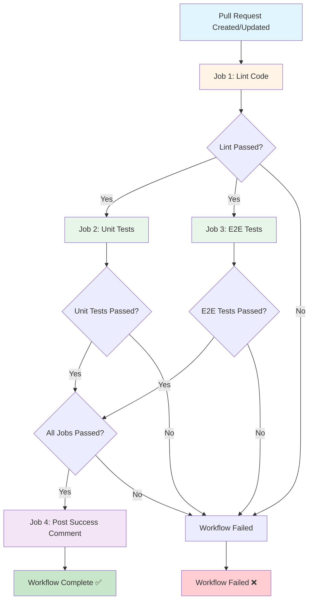
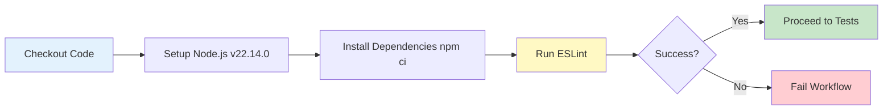
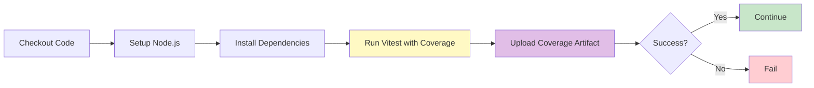
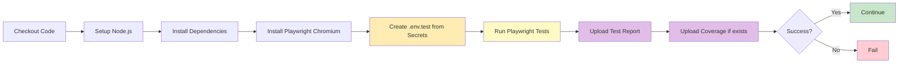
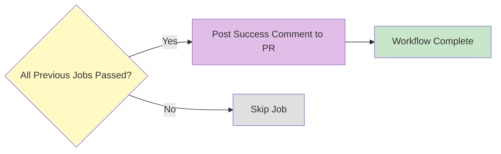
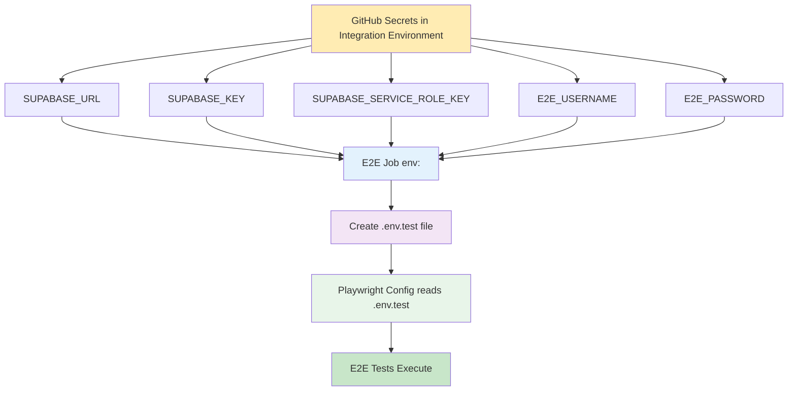
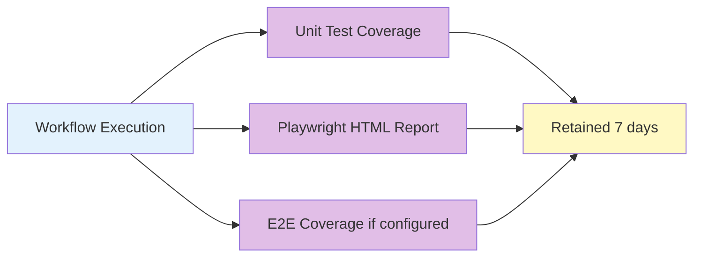

# Pull Request CI Workflow Diagram

## Workflow Structure



## Job Details

### Job 1: Lint (Sequential)


### Job 2 & 3: Unit Tests + E2E Tests (Parallel)

#### Unit Tests


#### E2E Tests (Integration Environment)


### Job 4: Status Comment (Conditional)


## Environment & Secrets Flow



## Artifacts Generated



## Timing & Parallelization

```
Time →

Lint:        [====] ~30s-1m
              ↓
Unit Tests:        [======] ~1-3m (parallel)
E2E Tests:         [==========] ~3-5m (parallel)
              ↓
Comment:                      [=] ~5s
                              
Total: ~4-7 minutes (depending on test suite size)
```

## Key Features

✅ **Sequential Linting** - Catches issues early before running expensive tests
✅ **Parallel Testing** - Unit and E2E tests run simultaneously to save time
✅ **Environment Isolation** - E2E tests use integration environment with dedicated secrets
✅ **Conditional Success Comment** - Only posts when ALL jobs pass
✅ **Artifact Collection** - Preserves coverage and test reports for review
✅ **Smart Browser Installation** - Only installs required Chromium browser
✅ **Proper Dependencies** - Uses npm ci for reproducible builds
